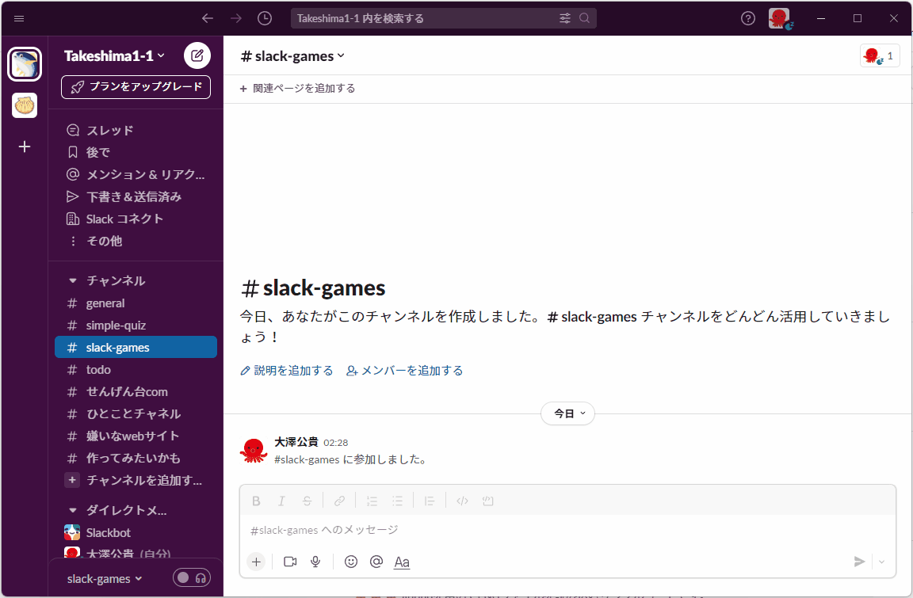
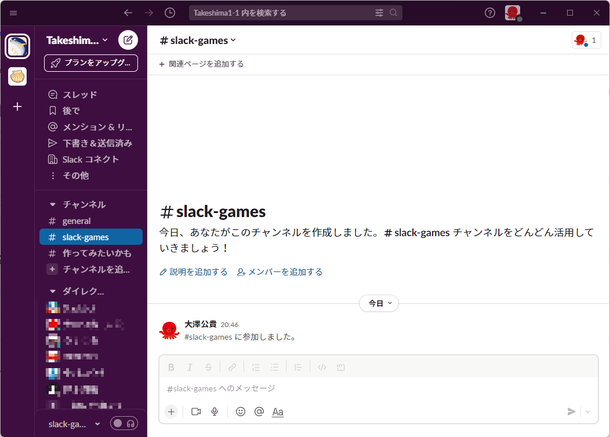

# slack-games

🍺🍺🍺 Slack上で遊べるゲームを作ってみた！  

## ゲーム一覧

- [x] しりとり
- [x] 山手線ゲーム

  
  

<!-- 1152 x 755 -->

## 準備

以下のGitHub Secretsを設定します。  

| Name | Value |
| --- | --- |
| AWS_ACCESS_KEY_ID | AWSアクセスキー |
| AWS_SECRET_ACCESS_KEY | AWSシークレットキー |
| AWS_REGION | AWSリージョン |

## 開発用実行

```shell
cd ./api
sam build --use-container ;; sam local start-api
```

## ボットの作成方法

1. [Slack App](https://api.slack.com/apps)にアクセスして、`Create New App`をクリックします。
2. From scratchを選択し、App NameとDevelopment Slack Workspaceを入力します。
3. OAuth & Permissionsメニューから、以下のScope(Bot Token Scopes)を追加します。
   - `chat:write`
4. 同じく、OAuth & Permissionsメニューから、`Install to Workspace`をクリックします。
5. Bot User OAuth Tokenをコピーして.envファイルに貼り付けます。
6. Event Subscriptionsメニューへ移動し、`Enable Events`をクリックします。
7. Subscribe to bot eventsで、以下のイベントを追加します。
   - `message.channels`
   - `app_mention`
8. 同じく、Event Subscriptionsメニューから、Request URLにURLを入力します。
9. Save Changesをクリックします。
10. 再度、OAuth & Permissionsメニューから、`Install to Workspace`をクリックします。

## 使用している技術

- AWS
  - Lambda
  - API Gateway
  - DynamoDB
  - S3
  - CloudFormation
  - AWS SAM
  - ECR
- Slack
  - Slack API
- Python
- GitHub
  - GitHub Actions
  - GitHub Repository
- Docker
